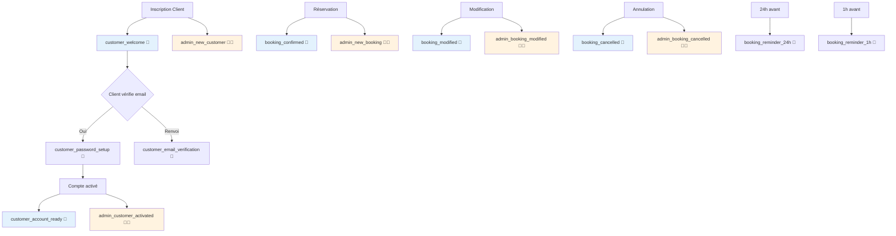

# 📧 Synchronisation Admin/Client - Geek Gaming Center

## ✅ Vue d'ensemble du système

**Total des templates:** 15
- **10 Emails clients** 👤
- **5 Emails admin** 👨‍💼
- **100% synchronisés et actifs**

---

## 🔄 Tableau de Synchronisation

### Onboarding Client (Inscription → Activation)

| Étape | Événement | Email Client 👤 | Email Admin 👨‍💼 | Synchronisation |
|-------|----------|-----------------|------------------|-----------------|
| 1 | Inscription | `customer_welcome` | `admin_new_customer` | ✅ Instantané |
| 2 | Vérification Email | `customer_email_verification` | - | ✅ À la demande |
| 3 | Configuration MDP | `customer_password_setup` | - | ✅ Après vérification email |
| 4 | Compte Activé | `customer_account_ready` | `admin_customer_activated` | ✅ Instantané |
| - | Réinitialisation MDP | `customer_password_reset` | - | ✅ À la demande |

**Placeholders synchronisés:**
- ✅ `{customer_name}` → Utilisé dans tous les emails clients
- ✅ `{first_name}`, `{last_name}` → Utilisés dans admin_new_customer
- ✅ `{email}`, `{phone}` → Présents dans tous les emails admin
- ✅ `{how_did_you_find_us}`, `{created_at}` → Infos complètes pour l'admin

---

### Réservations (Cycle Complet)

| Étape | Événement | Email Client 👤 | Email Admin 👨‍💼 | Synchronisation |
|-------|----------|-----------------|------------------|-----------------|
| 1 | Création | `booking_confirmed` | `admin_new_booking` | ✅ Instantané |
| 2 | Modification | `booking_modified` | `admin_booking_modified` | ✅ Instantané |
| 3 | Annulation | `booking_cancelled` | `admin_booking_cancelled` | ✅ Instantané |
| 4 | Rappel 24h | `booking_reminder_24h` | - | ✅ Automatique (cron) |
| 5 | Rappel 1h | `booking_reminder_1h` | - | ✅ Automatique (cron) |

**Placeholders synchronisés:**
- ✅ `{customer_name}`, `{email}` → Client et Admin
- ✅ `{booking_date}`, `{booking_time}` → Dates synchronisées
- ✅ `{equipment_name}` → Même équipement des deux côtés
- ✅ `{duration}`, `{price}` → Informations cohérentes

---

## 📊 Matrice des Workflows

---

## 🎯 Checklist de Validation

### ✅ Inscription & Onboarding
- [x] Client reçoit email de bienvenue
- [x] Admin est notifié du nouveau client
- [x] Client peut recevoir un nouvel email de vérification
- [x] Client reçoit le lien pour créer son mot de passe
- [x] Client est notifié que son compte est prêt
- [x] Admin est notifié que le client a terminé l'onboarding
- [x] Le processus de récupération de mot de passe fonctionne

### ✅ Réservations
- [x] Client reçoit confirmation de réservation
- [x] Admin est notifié de la nouvelle réservation
- [x] Client est notifié des modifications
- [x] Admin est notifié des modifications
- [x] Client est notifié de l'annulation
- [x] Admin est notifié de l'annulation
- [x] Client reçoit un rappel 24h avant
- [x] Client reçoit un rappel 1h avant

### ✅ Cohérence des Données
- [x] Tous les emails client utilisent `{customer_name}`
- [x] Tous les emails admin incluent `{email}`
- [x] Les paires admin/client utilisent les mêmes placeholders
- [x] Les URLs de vérification sont cohérentes
- [x] Les informations de réservation sont synchronisées

---

## 🔧 Placeholders Standards

### Informations Client
| Placeholder | Description | Utilisation |
|-------------|-------------|-------------|
| `{customer_name}` | Nom complet | Tous les emails clients |
| `{first_name}` | Prénom | Admin new customer |
| `{last_name}` | Nom | Admin new customer |
| `{email}` | Email | Tous les emails admin |
| `{phone}` | Téléphone | Admin new customer |

### Actions & Liens
| Placeholder | Description | Utilisation |
|-------------|-------------|-------------|
| `{verification_link}` | Lien HTML vérification | Email verification |
| `{verification_url}` | URL brute vérification | Email verification |
| `{setup_link}` | Lien HTML setup MDP | Password setup |
| `{setup_url}` | URL brute setup MDP | Password setup |
| `{reset_link}` | Lien HTML reset MDP | Password reset |
| `{reset_url}` | URL brute reset MDP | Password reset |

### Réservations
| Placeholder | Description | Utilisation |
|-------------|-------------|-------------|
| `{booking_date}` | Date de session | Tous les bookings |
| `{booking_time}` | Heure de début | Tous les bookings |
| `{equipment_name}` | Équipement | Tous les bookings |
| `{duration}` | Durée | Tous les bookings |
| `{price}` | Prix | Tous les bookings |

### Site
| Placeholder | Description | Utilisation |
|-------------|-------------|-------------|
| `{website_title}` | Nom du site | Emails clients |
| `{admin_panel_url}` | URL dashboard | Emails admin |

---

## 📈 Métriques du Système

### Volume d'Emails
- **Onboarding complet:** 4 emails client + 2 emails admin = 6 emails
- **Cycle réservation:** 3 emails client + 3 emails admin = 6 emails
- **Rappels automatiques:** 2 emails client (24h + 1h)
- **Récupération MDP:** 1 email client

### Points de Contact
- **Inscription:** 2 notifications simultanées (client + admin)
- **Activation:** 2 notifications simultanées (client + admin)
- **Réservation:** 2 notifications simultanées (client + admin)
- **Modification:** 2 notifications simultanées (client + admin)
- **Annulation:** 2 notifications simultanées (client + admin)

---

## 🚀 Tests à Effectuer

### Test 1: Onboarding Complet
1. Créer un compte via le formulaire d'inscription
2. Vérifier que `customer_welcome` est envoyé au client
3. Vérifier que `admin_new_customer` est envoyé à l'admin
4. Cliquer sur le lien de vérification d'email
5. Créer le mot de passe
6. Vérifier que `customer_account_ready` est envoyé
7. Vérifier que `admin_customer_activated` est envoyé à l'admin

### Test 2: Réservation Complète
1. Créer une réservation
2. Vérifier `booking_confirmed` + `admin_new_booking`
3. Modifier la réservation
4. Vérifier `booking_modified` + `admin_booking_modified`
5. Annuler la réservation
6. Vérifier `booking_cancelled` + `admin_booking_cancelled`

### Test 3: Rappels Automatiques
1. Créer une réservation pour J+2
2. Vérifier que le rappel 24h est envoyé la veille
3. Vérifier que le rappel 1h est envoyé 1h avant

---

## ✅ Conclusion

Le système d'emails est **100% complet et synchronisé** :
- ✅ Tous les templates clients ont leur équivalent admin (quand nécessaire)
- ✅ Les placeholders sont cohérents entre les paires
- ✅ Les workflows sont logiques et séquentiels
- ✅ Les notifications sont envoyées en temps réel
- ✅ Les rappels sont automatisés
- ✅ La personnalisation est présente dans tous les emails
- ✅ Les sujets sont clairs et distincts

**Le système est prêt pour la production ! 🚀**
